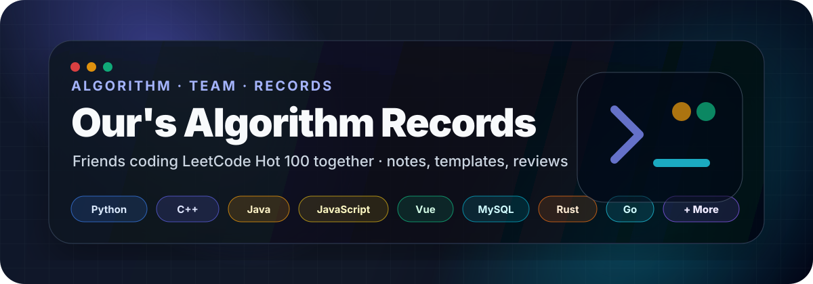
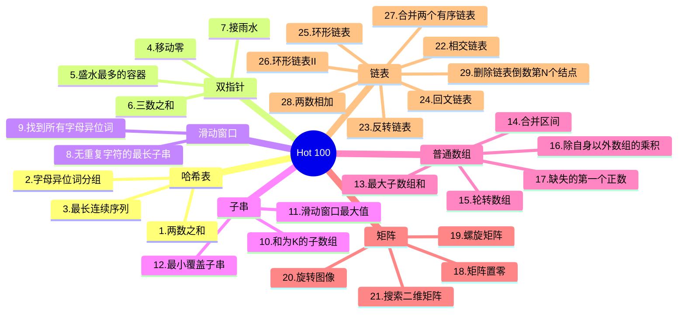

<p align="center">
  
</p>

<p align="center">
  <a href="#-仓库简介--about"></a>
  <a href="#-贡献者--contributors"></a>
  <a href="#-题目总览--problem-map"></a>
  <a href="#-如何添加内容--how-to-extend"></a>
</p>

<p align="center">
  
  
  
  
  
  
  
  
  
</p>

---

## 📌 目录 / Table of Contents

- [仓库简介 / About](#-仓库简介--about)
- [技术栈看板 / Language Board](#-技术栈看板--language-board)
- [当前进度 / Progress](#-当前进度--progress)
- [贡献者 / Contributors](#-贡献者--contributors)
- [仓库结构 / Structure](#-仓库结构--structure)
- [题目总览 / Problem Map](#-题目总览--problem-map)
- [复杂度速查 / Big-O Cheatsheet](#-复杂度速查--big-o-cheatsheet)
- [如何添加内容 / How to Extend](#-如何添加内容--how-to-extend)
- [内容模板 / Templates](#-内容模板--templates)

---

## 🧭 仓库简介 / About

> 这里是 **Our's Algorithm Records**：一个和好朋友们一起刷算法题的公共记录库。  
> 每个文件夹对应一位小伙伴的算法学习笔记，记录我们在 **LeetCode Hot 100** 上的每一步成长。  
> 代码不是冰冷的，它是我们一起度过的刷题时光。

<table>
  <tr>
    <td width="33%" align="center">
      <b>📚 题解记录</b><br>
      按专题整理代码、思路、复杂度与模板。
    </td>
    <td width="33%" align="center">
      <b>🤝 团队打卡</b><br>
      LY / CYF / WXQ 独立维护自己的目录，互相参考。
    </td>
    <td width="33%" align="center">
      <b>🧩 可扩展结构</b><br>
      后续可以继续添加新成员、新语言、新题单。
    </td>
  </tr>
</table>

---

## 🧱 技术栈看板 / Language Board

> 顶部 SVG 保留“多语言氛围”和 `+ More`，不建议把所有语言都塞进 SVG。  
> 后期如果语言越来越多，优先在这里追加 badge 和目录，README 会自动换行，更好维护。

| 分类 | 当前 / 可扩展方向 | 推荐目录 |
|:---|:---|:---|
| 算法语言 | Python · C++ · Java · JavaScript · Rust · Go | `成员名/python/`、`成员名/cpp/`、`成员名/java/`、`成员名/rust/`、`成员名/go/` |
| 前端记录 | Vue · JavaScript · TypeScript · 组件练习 | `成员名/vue/`、`成员名/frontend/` |
| 数据库笔记 | MySQL · SQL · 索引 · 查询优化 | `成员名/mysql/`、`成员名/sql/` |
| 模板总结 | 题型模板 · 复杂度 · 易错点 · 复盘 | `成员名/templates/` |

<p align="center">
  
  
</p>

---

## ✅ 当前进度 / Progress

| 成员 | 语言 / 方向 | 当前专题 | 完成情况 | 状态 |
|:---:|:---:|:---|:---:|:---:|
| LY | Python | Hot 100：哈希表、双指针、滑动窗口、子串、数组、矩阵、链表 | `29 / 29` | ✅ 当前阶段完成 |
| CYF | Python · Go | Hot 100：哈希表、双指针、滑动窗口 | `1 / 9` | 🚧 开始阶段 |
| WXQ | 待定 | 待定 | `0 / 100` | ⏳ 准备中 |

> 新增语言时，不需要改整体结构：在本表把“语言 / 方向”改成对应语言，并在个人目录下新增对应文件夹即可。

---

## 👥 贡献者 / Contributors

### ♠ LY


| 专题 | 进度 | 备注 |
|:---|:---:|:---|
| 1-3 哈希表 | `3 / 3` | ✅ 完成 |
| 4-7 双指针 | `4 / 4` | ✅ 完成 |
| 8-9 滑动窗口 | `2 / 2` | ✅ 完成 |
| 10-12 子串 | `3 / 3` | ✅ 完成 |
| 13-17 普通数组 | `5 / 5` | ✅ 完成 |
| 18-21 矩阵 | `4 / 4` | ✅ 完成 |
| 22-35 链表 | `9 / 14` | 🚧 当前阶段完成到第 29 题 |
| 模板总结 | 持续补充 | 哈希表 · 双指针 · 链表 |

### ♦ CYF


| 专题 | 进度 | 备注 |
|:---|:---:|:---|
| 1-3 哈希表 | `0 / 3` | ⏳ 待开始 |
| 4-7 双指针 | `0 / 4` | ⏳ 待开始 |
| 8-9 滑动窗口 | `0 / 2` | ⏳ 待开始 |

### ♥ WXQ


| 专题 | 进度 | 备注 |
|:---|:---:|:---|
| 待定 | `0 / ?` | ⏳ 待开始 |

---

## 🗂️ 仓库结构 / Structure

```text
Our-s-algorithm-records/
├── assets/
│   ├── readme-hero.svg                 # README 顶部视觉图：多语言技术栈版
│   └── readme-hero-minimal.svg         # 备用：极简标题版
│
├── LY/
│   └── python/
│       ├── 1-3哈希表/                   # 两数之和 · 字母异位词分组 · 最长连续序列
│       ├── 4-7双指针/                   # 移动零 · 盛水最多的容器 · 三数之和 · 接雨水
│       ├── 8-9滑动窗口/                 # 无重复字符最长子串 · 找所有字母异位词
│       ├── 10-12子串/                   # 和为K子数组 · 滑动窗口最大值 · 最小覆盖子串
│       ├── 13-17普通数组/               # 最大子数组和 · 合并区间 · 轮转数组 · 除了自身乘积 · 缺失第一个正数
│       ├── 18-21矩阵/                   # 矩阵置零 · 螺旋矩阵 · 旋转图像 · 搜索二维矩阵
│       ├── 22-35链表/                   # 相交 · 反转 · 回文 · 环形 · 合并 · 两数相加 · 删除倒数第N
│       └── 模板总结/                    # 算法模板 & 笔记
│
├── CYF/
│   └── 待定语言/                        # 例如 java/、cpp/、go/、rust/
│
├── WXQ/
│   └── 待定语言/                        # 例如 python/、javascript/、mysql/
│
└── README.md
```

---

## 🧠 题目总览 / Problem Map



---

## ⚙️ 复杂度速查 / Big-O Cheatsheet

| 数据结构 | 插入 | 删除 | 查找 | 常用场景 |
|:---|:---:|:---:|:---:|:---|
| Array / 数组 | `O(n)` | `O(n)` | `O(1)` / `O(n)` | 下标访问、双指针、滑动窗口 |
| Linked List / 链表 | `O(1)` | `O(1)` | `O(n)` | 反转、快慢指针、合并 |
| Hash Map / 哈希表 | `O(1)*` | `O(1)*` | `O(1)*` | 计数、去重、映射关系 |
| Heap / 堆 | `O(log n)` | `O(log n)` | `O(1)` | Top K、优先队列 |
| Stack / 栈 | `O(1)` | `O(1)` | `O(n)` | 单调栈、括号匹配、DFS |
| Queue / 队列 | `O(1)` | `O(1)` | `O(n)` | BFS、层序遍历 |

> `*` 表示平均复杂度；极端冲突情况下可能退化。

---

## 🧩 如何添加内容 / How to Extend

### 1. 新增一位成员

```bash
mkdir -p YOUR_NAME/YOUR_LANGUAGE

# 示例
mkdir -p CYF/java
mkdir -p WXQ/go
mkdir -p LY/rust
```

然后在 README 的两个地方追加信息：

1. [当前进度 / Progress](#-当前进度--progress) 表格追加一行
2. [贡献者 / Contributors](#-贡献者--contributors) 复制一张成员卡片

### 2. 新增一个语言

推荐只改三个位置：

1. 顶部 badge 区追加一个语言 badge
2. [技术栈看板 / Language Board](#-技术栈看板--language-board) 表格补充方向
3. 对应成员目录下新增语言文件夹

> SVG 不需要每次都改。它已经用 `+ More` 表示后续可扩展，避免语言越来越多导致顶部图拥挤。

### 3. 新增一个专题

推荐目录格式：

```text
YOUR_NAME/YOUR_LANGUAGE/
└── 36-40二叉树/
    ├── 36.二叉树的中序遍历.md
    ├── 37.二叉树的最大深度.md
    └── README.md
```

### 4. 新增一道题解

建议每道题都包含：

- 题目链接
- 解题思路
- 复杂度分析
- 代码实现
- 易错点 / 复盘

### 5. 提交 Pull Request

```bash
git checkout -b docs/add-your-notes
git add .
git commit -m "docs: add algorithm notes"
git push origin docs/add-your-notes
```

---

## 🧾 内容模板 / Templates

<details>
<summary><b>成员卡片模板</b></summary>

```md
### ♣ YOUR_NAME


| 专题 | 进度 | 备注 |
|:---|:---:|:---|
| 哈希表 | `0 / 3` | ⏳ 待开始 |
| 双指针 | `0 / 4` | ⏳ 待开始 |
| 滑动窗口 | `0 / 2` | ⏳ 待开始 |
```

</details>

<details>
<summary><b>新增语言 badge 模板</b></summary>

```html


```

</details>

<details>
<summary><b>题解模板</b></summary>

````md
# 题目名称

## 题目链接

- LeetCode：

## 思路

1. 
2. 
3. 

## 复杂度

- 时间复杂度：
- 空间复杂度：

## 代码

```python
class Solution:
    pass
```

## 易错点

- 
````

</details>

---

## 🚀 Roadmap

- [ ] 补齐 Hot 100 剩余专题
- [ ] 为每个专题增加 `README.md` 总结
- [ ] 增加 Python / C++ / Java / Rust / Go 模板库
- [ ] 增加常见算法复杂度对比图
- [ ] 增加自动统计进度脚本

---

<p align="center">
  <sub>Made with ❤️ by LY · CYF · WXQ · Powered by countless late-night submissions</sub>
  <br><br>
  
</p>
